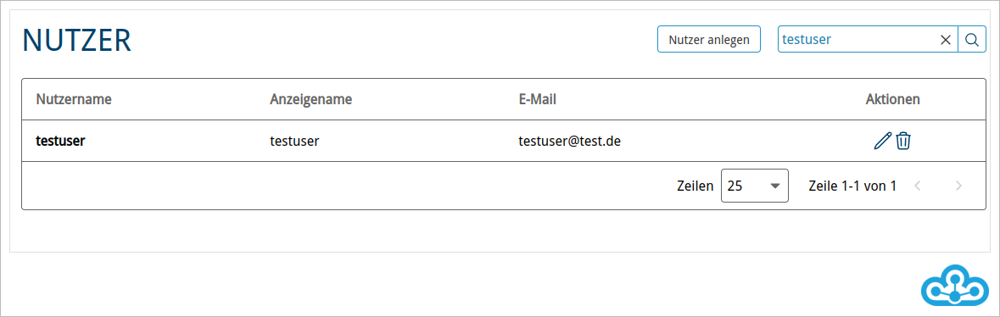
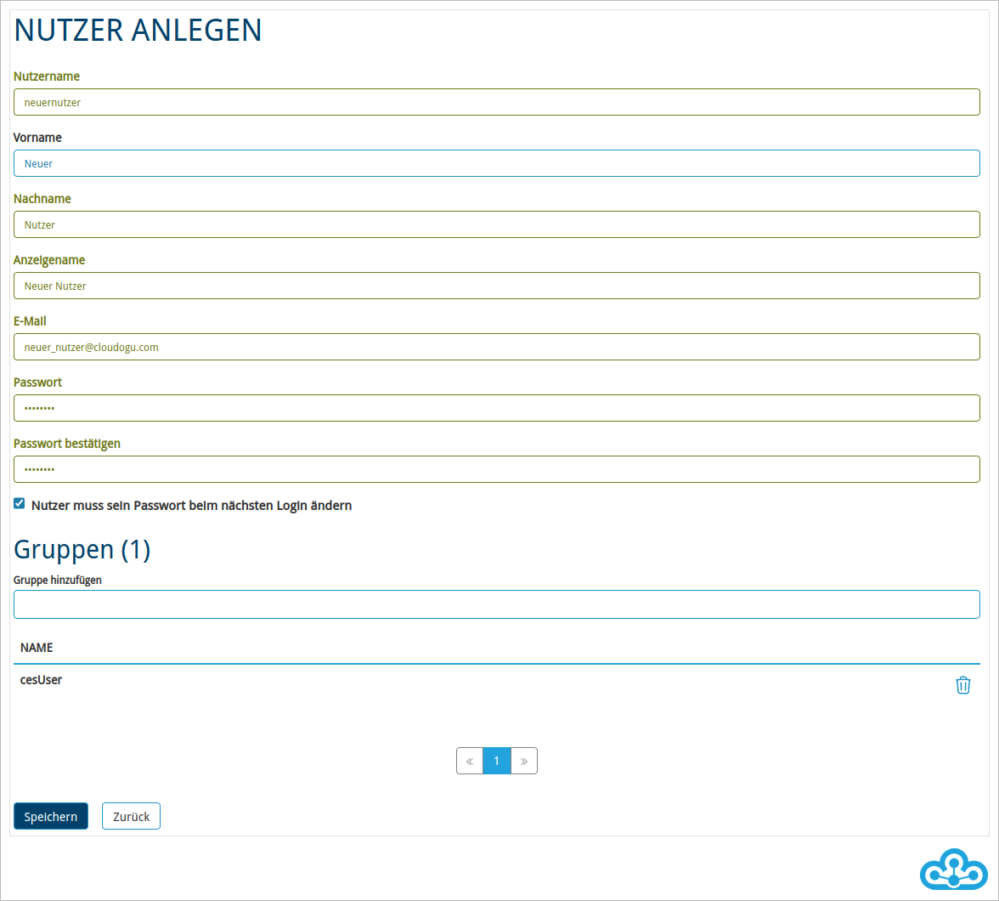
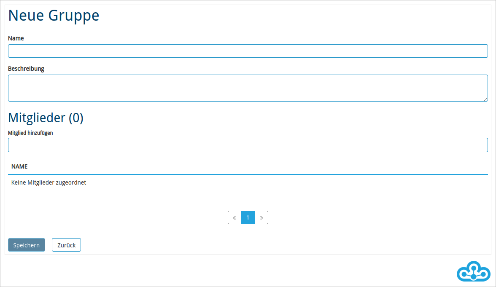
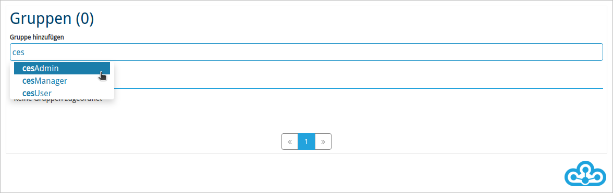
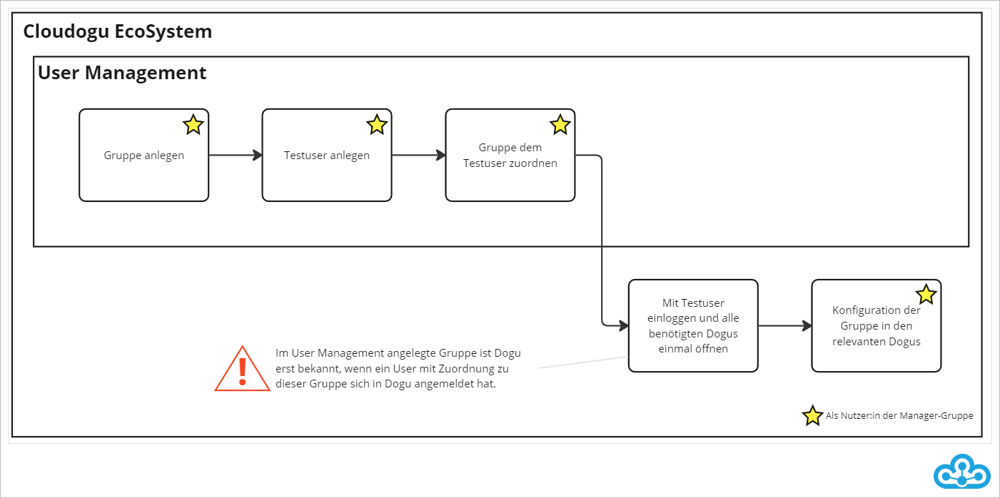
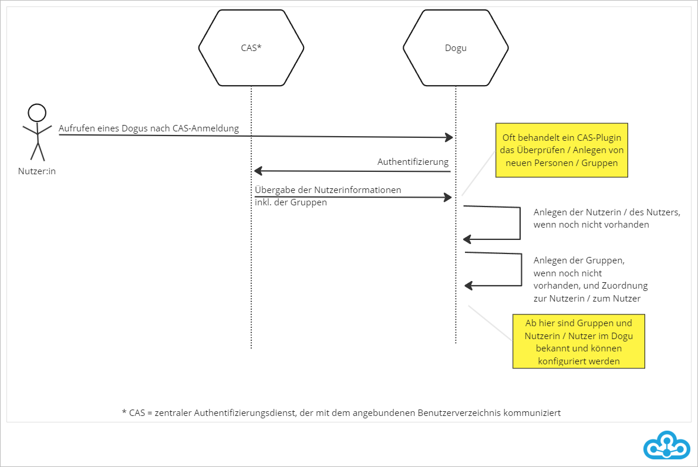
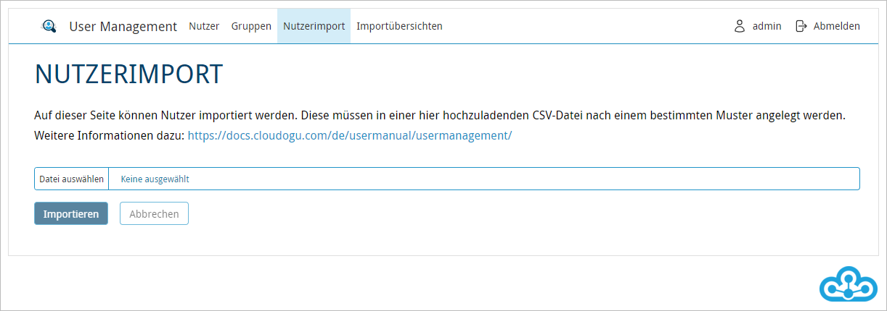
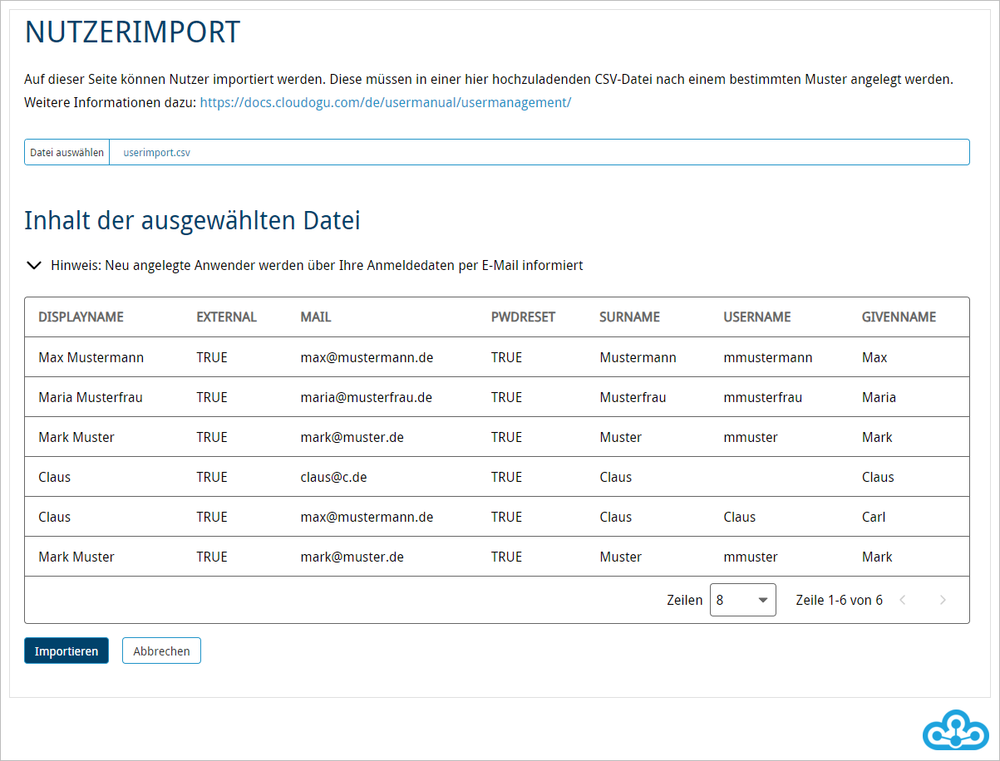

# Dokumentation

Das **User Management** ist ein Dogu zum **Verwalten der Nutzer:innen und Gruppen des Cloudogu EcoSystems**. Neben den eigenen persönlichen Daten können Sie hier, wenn Sie die benötigten Rechte haben, Nutzer:innen sowie Gruppen anlegen, bearbeiten und löschen.

Das **User Management** erreichen Sie über das Warp Menü im Bereich „Administration“.


## Persönliche Daten

Als Nutzer:in des Cloudogu EcoSystem können Sie **Ihre persönlichen Daten** im Account-Bereich ändern.


Der eigene Account-Bereich wird Ihnen beim Öffnen des **User Managements** direkt angezeigt. Über das 
Formular können Sie Ihre persönlichen Daten, wie Ihre E-Mail-Adresse oder Ihr Passwort, anpassen. Die Anpassungen, die Sie vornehmen, werden erst **mit einem Klick auf den Speichern-Button aktualisiert**. Der Nutzername kann nicht geändert werden.

Im unteren Teil des Account-Bereichs können Sie die Ihnen zugeordneten Gruppen sehen.


## Verwaltung von Accounts

Als Administrator:in haben Sie im **User Management** die Möglichkeit, **Nutzer:innen anzulegen, zu löschen und zu bearbeiten**.

### Suche nach Accounts

Sofern Sie eine Vielzahl an Nutzer:innen administrieren, hilft Ihnen die **Suchfunktion**, einen gewünschten Account zu finden.

1. Wählen Sie den Reiter „Nutzer“ aus.


2. Geben Sie dort im Bereich "Filter" Nutzername, Anzeigename oder E-Mail-Adresse des Accounts ein, den Sie finden möchten, und drücken Sie *Enter*. Ihnen werden in der Tabelle dann nur die Accounts angezeigt, die mit Ihrem Suchkriterium übereinstimmen.



Um den Filter wieder zu entfernen, klicken Sie auf das „X“-Symbol innerhalb des Suchfeldes.

### Änderung von Account-Daten

Um die Daten eines Accounts zu ändern, klicken Sie zunächst im Reiter „Nutzer“ auf das Stift-Symbol in der Zeile des Accounts, den Sie ändern möchten.


Danach können Sie Änderungen vornehmen und diese durch einen Klick auf den „Speichern“-Button sichern. 
Neben den eigentlichen Account-Informationen, wie E-Mail-Adresse oder Anzeigename, können Sie auch das Passwort ändern. Zusätzlich dazu bietet das **User Management** die Möglichkeit, dass Passwort durch die Nutzerin / den Nutzer beim nächsten Login ändern zu lassen. 

Beachten Sie, dass Sie den Nutzernamen **nicht** ändern können.

### Löschen von Accounts

Klicken Sie zum Löschen eines Accounts auf der Seite „Nutzer“ auf das Mülltonnen-Symbol in der Zeile des Accounts, den Sie löschen wollen. Es folgt eine Sicherheitsabfrage, die Sie bestätigen müssen, bevor der Account endgültig gelöscht wird.

Beachten Sie, dass im **User Management** gelöschte Accounts nicht automatisch auch in den Dogus gelöscht werden.


### Anlegen neuer Accounts

Um einen neuen Account für das Cloudogu EcoSystem anzulegen, rufen Sie zunächst den Reiter „Nutzer“ auf und klicken auf den Button „Nutzer anlegen“.


Ein Formular öffnet sich, in dem Sie folgende Eigenschaften des neuen Accounts eintragen können:

* Nutzername* (für die Anmeldung am Cloudogu EcoSystem)
* Vorname
* Nachname
* Anzeigename (angezeigter Name des Accounts in den einzelnen Dogus)
* E-Mail* (Nutzer:in wird über diese E-Mail benachrichtigt)
* Passwort (für die Anmeldung am Cloudogu EcoSystem)
* „Nutzer muss sein Passwort beim nächsten Login ändern“ (Wird diese Option aktiviert, muss bei der nächsten Anmeldung des Accounts das Passwort geändert werden)

\* E-Mail-Adresse und Nutzername eines Accounts sind **eindeutige Eigenschaften** und dürfen daher nur für einen Account verwendet werden. Beim Anlegen eines Accounts wird überprüft, ob E-Mail-Adresse und Nutzername eindeutig sind. Sollte das nicht der Fall sein, bekommen Sie eine aussagekräftige Fehlermeldung angezeigt und können die Angaben des Accounts überarbeiten.

> Beachten Sie, dass der Nutzername nach der Anlage des Accounts **unveränderlich** ist.



Den Account legen Sie mit einem Klick auf den „Speichern“-Button an.


Nachdem Sie gespeichert haben, wird Ihnen der neu angelegte Account auf der Seite „Nutzer“ angezeigt. 
Sofern Sie noch weitere Änderungen vornehmen möchten, klicken Sie in der letzten Spalte auf das Stift-Symbol.

### Passwort-Richtlinien

In der Konfiguration des Cloudogu EcoSystem können **Passwort-Richtlinien** konfiguriert werden, die bei Eingabe der Passwörter validiert werden. 
Durch das Anlegen von sinnvollen Passwort-Richtlinien kann die Sicherheit der Passwörter global kontrolliert werden.

Wenn Sie ein Passwort anlegen, bekommen Sie immer die Passwort-Richtlinien angezeigt, die noch nicht erfüllt worden sind. Sobald eine Passwort-Richtlinie erfüllt ist, wird diese nicht mehr angezeigt.


Sie können das Passwort erst speichern, wenn alle Passwort-Richtlinien erfüllt worden sind.

Sind alle Passwort-Richtlinien erfüllt, wird das Feld grün markiert und das neue Passwort kann gespeichert werden.


## Verwaltung von Gruppen

Als Administrator:in haben Sie im **User Management** die Möglichkeit, **Gruppen anzulegen, zu bearbeiten oder zu löschen sowie die Mitglieder von Gruppen zu verwalten**.

Gruppen können zur Verwaltung von unterschiedlichen Rechtekonfigurationen für unterschiedliche Nutzergruppen verwendet werden. Mehr Informationen dazu finden Sie im Abschnitt [Rechtekonzept im Cloudogu EcoSystem](#rechtekonzept-im-cloudogu-ecosystem).

### Systemgruppen

Im **User Management** finden Sie zwei vordefinierte Gruppen. Mitglieder dieser Gruppen haben besondere Berechtigungen in den Dogus des Cloudogu EcoSystem.

**Manager-Gruppe**

Mitglieder der **Manager-Gruppe** haben **vollen Zugriff auf das User Management** des Cloudogu EcoSystems.
Damit erhalten Nutzer:innen die Berechtigung, weitere Accounts und Gruppen anzulegen und zu verwalten.
Darüber hinaus sind keine weiteren Berechtigungen mit der *Manager-Gruppe* verbunden.

Sie können die zu verwendende *Manager-Gruppe* ändern, indem Sie in der Konfiguration des Cloudogu EcoSystem im Eintrag 
`/config/_global/manager_group` die gewünschte Gruppe einstellen:

```shell
etcdctl set /config/_global/manager_group neueManagerGruppe
```

Das **User Management**-Dogu muss anschließend neu gestartet werden, damit die Änderung wirksam wird.

**Admin-Gruppe**

Mitglieder dieser Gruppe haben in **allen** Dogus des Cloudogu EcoSystem administrative 
Berechtigungen. Diese Nutzer:innen können in den einzelnen Dogus die administrativen Funktionen nutzen 
und so zum Beispiel Plugins installieren oder Anwendungseinstellungen vornehmen.

Die Nutzung des **Backup & Restore**-Dogus ist ausschließlich Administrator:innen vorbehalten.
Somit haben nur Nutzer:innen auf das **Backup & Restore**-Dogu Zugriff, die Mitglieder der **Admin-Gruppe** sind.

Sie können die zu verwendende **Admin-Gruppe** ändern, indem Sie in der Konfiguration des Cloudogu EcoSystem im Eintrag
`/config/_global/admin_group` die gewünschte Gruppe einstellen:

```shell
etcdctl set /config/_global/admin_group neueAdminGruppe
```

Es müssen anschließend alle Dogus neu gestartet werden, damit die Änderung wirksam wird.

### Anlegen einer neuen Gruppe

Um nicht für alle Accounts einzelne Berechtigungen in den Dogus vergeben zu müssen, können Sie - wie im Folgenden beschrieben - Gruppen angelegen:

Wählen Sie im **User Management** den Reiter „Gruppen“ aus.


Klicken Sie auf den Button „Gruppe anlegen“.



Definieren Sie anschließend die Eigenschaften der neuen Gruppe:
  * Name*
  *  Beschreibung

  \* Der Name einer Gruppe ist eine **eindeutige Eigenschaften** und darf daher nur für eine Gruppe verwendet werden. Beim Anlegen einer Gruppe wird überprüft, ob der Name eindeutig ist. Sollte das nicht der Fall sein, bekommen Sie eine aussagekräftige Fehlermeldung angezeigt und können den Namen der Gruppe überarbeiten.

> Beachten Sie, dass der Gruppenname nach der Anlage der Gruppe unveränderlich ist.

Legen Sie die Gruppe mit einem Klick auf den „Speichern“-Button an.

### Gruppenzuordnung

Es gibt zwei Wege, einen Account einer Gruppe zuzuordnen:
* Über das Bearbeiten des Accounts
* Über das Bearbeiten der Gruppe

**Gruppenzuordnung über das Bearbeiten eines Accounts:**

1. Im Reiter „Nutzer“ wählen Sie für den entsprechenden Account das Stift-Symbol aus.

2. Danach tragen sie im Bereich „Gruppen“ unter *Gruppe hinzufügen* den Gruppennamen ein. Es erscheint automatische eine Liste mit Vorschlägen entsprechend der getätigten Eingabe. 
3. Mit einem Klick auf die gewünschte Gruppe ordnen Sie dem Account die Gruppe zu.



4. Mit einem Klick auf den „Speichern“-Button werden die Änderungen gespeichert.

**Gruppenzuordnung über das Bearbeiten einer Gruppe:**

1. Im Reiter „Gruppen“ wählen Sie für die entsprechende Gruppe das Stift-Symbol aus.
2. Im Bereich „Mitglieder“ können Sie den Nutzernamen des gewünschten Mitglieds hinzufügen. Es erscheint automatische eine Liste mit
  Vorschlägen entsprechend der getätigten Eingabe. 
3. Mit einem Klick auf den gewünschten Nutzernamen in der 
  Vorschlagsliste wird der Account der Gruppe zugeordnet.


4. Mit einem Klick auf den „Speichern“-Button wird die Zuordnung gespeichert.

### Löschen einer Gruppe

Klicken Sie zum Löschen einer Gruppe im Bereich „Gruppen“ auf das Mülleimer-Symbol der jeweiligen Gruppe und bestätigen Sie die Sicherheitsabfrage.

Systemgruppen können **nicht** gelöscht werden.

Beachten Sie, dass im **User Management** gelöschte Gruppen nicht automatisch auch in den Dogus gelöscht werden. Die Zuordnung von Accounts zu Gruppen wird aber synchronisiert.

## Rechtekonzept im Cloudogu EcoSystem

Das Rechtekonzept des Cloudogu EcoSystems basiert auf einer **zentralen Benutzerverwaltung** und einer **dezentralen Rechtekonfiguration**: Accounts und Gruppen können im **User Management** hinterlegt werden. Diese werden den anderen Dogus des Cloudogu EcoSystems bekannt gemacht, wodurch Sie in jedem Dogu die Rechtezuordnung dezentral für Gruppen oder einzelne Accounts vornehmen können.

### Benutzerverwaltung

Das **User Management** dient der Verwaltung von Accounts und Gruppen. Dabei nutzt das **User Management** ein internes *LDAP* als Verzeichnisdienst.

Neben der Nutzung des von Cloudogu zu Verfügung gestellten **User Managements** haben Sie die Möglichkeit, einen **externen Verzeichnisdienst** für das Cloudogu EcoSystem zu verwenden. In diesem Fall würde die Benutzerverwaltung **nicht** über das hier vorgestellte Dogu **User Management** erfolgen, sondern über den von Ihnen angebundenen externen Verzeichnisdienst.

### Rechtekonzepte der Dogus

Die Accounts für Nutzer:innen des Cloudogu EcoSystems können Sie zentral im **User Management** anlegen. Dabei können Sie zur Vereinfachung der Rechtekonfiguration Gruppen für unterschiedliche Rechtekonfigurationen anlegen. Nutzer:innen können dabei mehr als einer Gruppe zugeordnet sein. In einer Gruppe kann mehr als ein Mitglied sein.

Accounts und Gruppen werden **mit den Dogus synchronisiert**, so dass Sie in jedem Dogu die im **User Management** angelegten Accounts und Gruppen vorfinden. 

 Da es sich bei Dogus um Anwendungen handeln kann, die außerhalb des Cloudogu EcoSystems entwickelt werden, können sich die **Rechtekonzepte der einzelnen Dogus unterscheiden** - wie im folgenden Schaubild exemplarisch dargestellt.

 

 Weitere Informationen zum Rechtekonzept einzelner Dogus finden Sie in der jeweiligen Dokumentation.

 Sie können auch direkt in den Dogus Accounts und Gruppen anlegen. Beachten Sie dabei, dass diese dann anderen Dogus nicht bekannt sind und auch nicht im **User Management** verwaltet werden können. Die Anlage von Accounts oder Gruppen außerhalb des **User Managements** ist daher **nicht** empfohlen.

### Synchronisation von Accounts und Gruppen

Nutzeraccounts und Gruppen werden an ein Dogu weitergeleitet, **sobald das Dogu vom zugehörigen Account aufgerufen wird**. Dafür werden die Gruppenzuordnungen der Nutzer:innen bei jeder Anmeldung an ein Dogu über den CAS (Central Authentication Service) - der zentrale *Single Sign-on* Authentifizierungsdienst des Cloudogu EcoSystem - neu abgefragt.

Wie im folgenden Schaubild erkennbar, übergibt der CAS nach erfolgreicher Authentifizierung die benötigten Nutzerinformationen an das Dogu. Das Dogu überprüft im Anschluss, ob der Account und die Gruppen des Accounts schon bekannt sind. Sollte dies nicht der Fall sein, werden Account und Gruppen angelegt und zugeordnet, wenn das Dogu dieses Vorgehen unterstützt.

In Dogus, die keine Gruppen oder Accounts verwalten, werden keine Gruppen oder Accounts hinterlegt. Für andere Dogus übernimmt das Anlegen von Accounts und Gruppen oft ein CAS-Plugin, welches für diesen Zweck konzipiert worden ist.

 

Ist ein Account schon intern im Dogu angelegt worden, wird der interne Account mit dem externen CAS-Account verknüpft, wenn der interne Nutzername mit dem externen Nutzernamen übereinstimmt. Dabei werden *im Regelfall* die internen Daten im Dogu mit den Daten aus dem **User Management** überschrieben und der Account wird wenn möglich, im Dogu als externer Account gekennzeichnet.

Beachten Sie beim Anlegen von Accounts und Gruppen im **User Management**, dass geänderte oder neu angelegte Accounts, Gruppen und Gruppenzuordnungen **nicht direkt** in anderen Dogus bekannt sind, sondern **bei der nächsten Anmeldung des Accounts im jeweiligen Dogu** bekannt gemacht werden.

Ausnahmen bestehen dabei bei den **Dogus Jira und Confluence**: Eine Synchronisation der Nutzerdaten wird in der Standardeinstellung alle 60 Minuten ausgelöst; diese Einstellung lässt sich im etcd über den key ```ldap/sync_interval``` reduzieren.
Alternativ kann sich ein Nutzer oder eine Nutzerin im CAS und dann nochmal bei Jira / Confluence anmelden, damit die Synchronisation für den Nutzer bzw. die Nutzerin in diesem Dogu abgeschlossen wird.
Eine weitere Alternative ist das manuelle Auslösen der Synchronisation über Administrator:innen: "Einstellungen (Zahnrad)" > "Benutzerverwaltung" > "Benutzerverzeichnisse" > "CES LDAP mapper dogu" > "Synchronisieren".
Die Synchronisation nach Zeit oder manuell durch Administrator:innen muss nur bei einem der zwei Dogus erfolgen - das andere Dogu wird dabei ebenfalls synchronisiert.

### Mögliches Vorgehen bei der Rechtekonfiguration

Möchten Sie als Administrator:in eine neue Gruppe anlegen und diese in unterschiedlichen Dogus direkt konfigurieren, kann sich das im folgenden Schaubild dargestellte Vorgehen empfehlen.

 

Mit Hilfe eines Testaccounts können Sie sich in die Dogus einloggen, in denen Sie die neu angelegte Gruppe konfigurieren wollen. Nachdem Sie die Gruppe mit Ihrem Account im Dogu konfiguriert haben, können Sie den Testaccount zusätzlich zum Testen der Konfiguration verwenden.

## Nutzerimport

### Importieren neuer Nutzerkonten

Über das User Management besteht die Möglichkeit, beliebig viele Nutzerkonten in nur einem Schritt über die Oberfläche zu importieren. 
Dafür muss eine CSV-Datei angelegt werden, die alle zu importierenden Konten enthält.

Als Import-Format wird CSV nach [RFC 4180](https://datatracker.ietf.org/doc/html/rfc4180) verwendet. Der Header der Datei muss
**7** Spalten definieren:

```csv
username,displayname,givenname,surname,mail,pwdReset,external
```
Die Reihenfolge der Spalten kann variieren, jedoch müssen die Namen der Spalten beibehalten werden. 

Ein Beispiel für eine funktionierende CSV-Datei:
```
displayname,external,mail,pwdreset,surname,username,givenname
Max Mustermann,TRUE,max@mustermann.de,TRUE,Mustermann,mmustermann,Max
Maria Musterfrau,TRUE,maria@musterfrau.de,TRUE,Musterfrau,mmusterfrau,Maria
Mark Muster,TRUE,mark@muster.de,TRUE,Muster,mmuster,Mark
Claus,TRUE,claus@c.de,TRUE,Claus,,Claus
Claus,TRUE,max@mustermann.de,TRUE,Claus,Claus,Carl
Mark Muster,TRUE,mark@muster.de,TRUE,Muster,mmuster,Mark
```

Um diese Datei nun zu importieren, muss über die Navigationsleiste im User Management zu dem Punkt 'Nutzerimport' navigiert werden.
Die Seite sollte dann wie folgt aussehen:



In dem dort zu sehenden Datei-Eingabefeld muss die zuvor erstellte CSV-Datei ausgewählt werden.
Sofern eine CSV-Datei ausgewählt wurde, ändert sich die Ansicht der Seite und der Inhalt der CSV-Datei wird tabellarisch dargestellt.



Durch einen Klick auf 'Importieren' wird die CSV-Datei gesendet und die Nutzerkonten darin werden importiert.

Anschließend wird die Ergebnisseite angezeigt. Dort ist zu sehen, ob der Import erfolgreich war.
Es ist möglich, dass neue Nutzerkonten angelegt werden, vorhandene aktualisiert werden oder das Zeilen aus der CSV-Datei
übersprungen werden, weil sie ungültige Werte enthalten. Das kann zum Beispiel der Fall sein, wenn notwendige Spalten nicht vorhanden waren
oder eine Bedingung wie eindeutige E-Mails nicht erfüllt war.

Auf der Ergebnis-Seite werden die Ergebnisse wie folgt dargestellt:


Durch einen Klick auf die jeweiligen Zeilen können mehr Details zu den hinzugefügten/aktualisierten Nutzerkonten sowie den
übersprungenen Zeilen angezeigt werden.


Außerdem kann durch das Klicken auf 'Importübersicht herunterladen' diese heruntergeladen werden.


### Verwalten vergangener Importe

Vergangene Importe werden im Dateisystem gespeichert, damit diese erneut abgerufen werden können.
Dafür wird die Importübersicht verwendet. um diese aufzurufen, klicken Sie in der Navigationsleiste auf den Eintrag
'Importübersichten'. Dort werden alle vergangenen Importe mit dem Namen der CSV-Datei sowie dem genauen Datum tabellarisch dargestellt.


Durch einen Klick auf das Auswahlfeld 'Funktionen' der jeweiligen Zeile öffnete sich ein kleines Untermenü. Hier können Sie direkt die jeweilige Übersicht herunterladen, die Übersicht aus dem System löschen oder sich über einen Klick auf 'Details' die Importübersicht detailliert anzeigen lassen.


