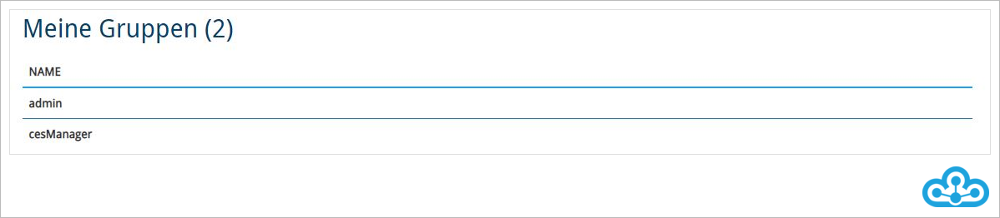
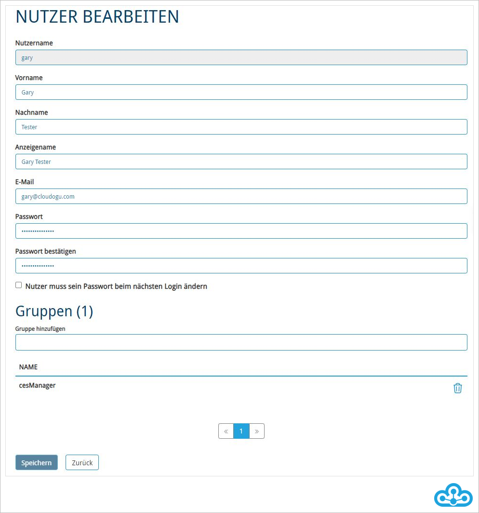
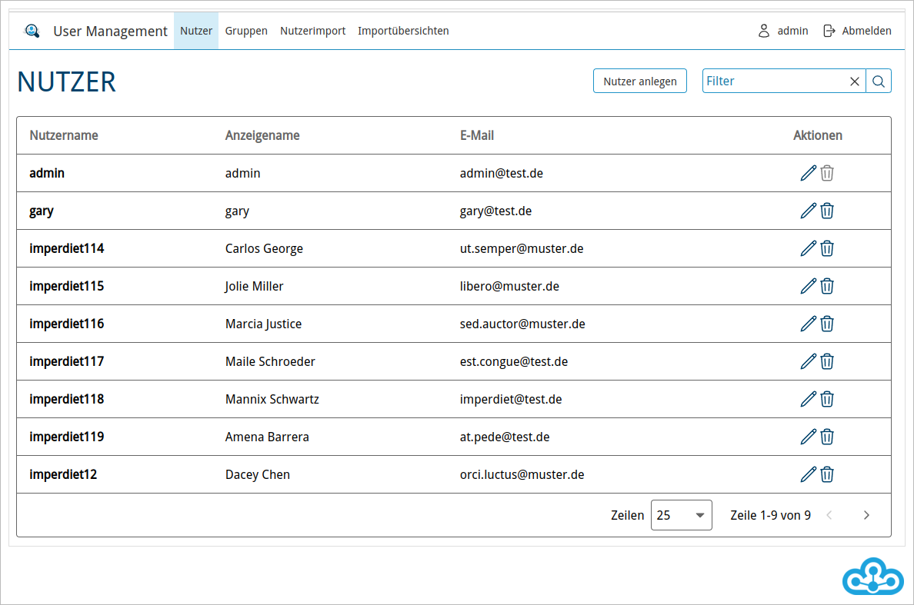
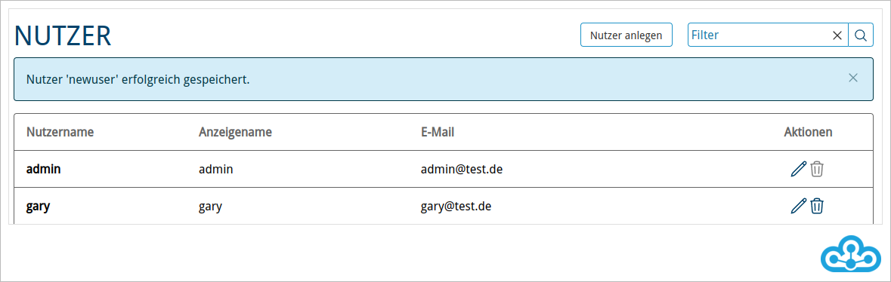
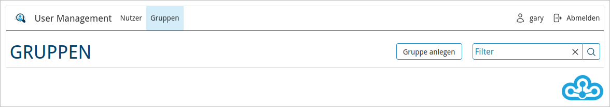
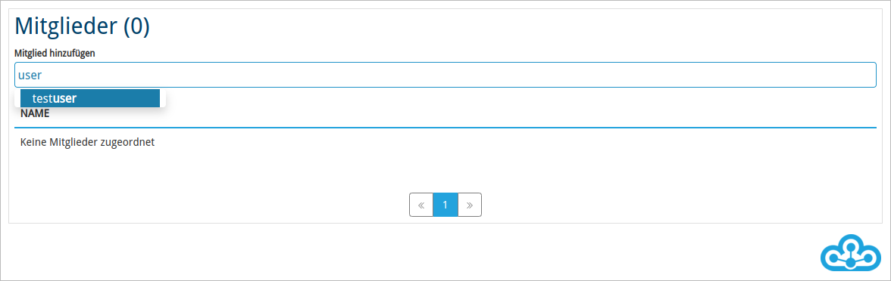

# User Management

Wenn kein externer Verzeichnisdienst für das Cloudogu EcoSystem konfiguriert ist, kann das Dogu „User Management“ benutzt 
werden, um Nutzerinnen und Nutzer anzulegen und Gruppen zu administrieren.

Wenn ein externer Verzeichnisdienst (wie LDAP oder AD) angebunden ist, erfolgt die Benutzerverwaltung über den angebundenen Dienst.

Das „User Management“ kann über das Warp Menü im Bereich „Administration“ aufgerufen werden.


## Persönliche Daten

Als Nutzerin oder Nutzer des Cloudogu EcoSystem können Sie Ihre persönlichen Daten im Bereich Account-Bereich ändern.


Nachdem Sie das „User Management“ aufgerufen haben, wird automatisch Ihr Account-Bereich angezeigt. Über das angezeigte 
Formular können Sie ihre persönlichen Daten anpassen und mit einem Klick auf den Speichern-Button die Eingaben bestätigen.

Im unteren Teil des Account-Bereichs können Sie die Ihre Gruppenmitgliedschaften einsehen.



Administratorinnen und Administratoren haben im User Management weitere Optionen, um Nutzerinnen und Nutzer anzulegen 
oder zu bearbeiten, deren Gruppenmitgliedschaften zu verwalten und um z.B. Passwörter zu setzen.



## Zugriff als Administratorin und Administrator

Als Administratorin und Administrator haben Sie zusätzlich die Möglichkeit, Nutzerinnen und Nutzer sowie Gruppen zu verwalten.

### Suche nach Nutzerinnen und Nutzern

Sofern Sie eine Vielzahl an Nutzerinnen und Nutzern administrieren müssen, hilft Ihnen die Suchfunktion.

1. Wählen Sie den Reiter „Nutzer“ aus.



2. Geben Sie dort im Bereich „Filter“ den „Nutzernamen“ oder den „Anzeigenamen“ der zu suchenden Nutzerin oder des Nutzers ein und drücken Sie Enter.
Um den Filter wieder zu entfernen, klicken Sie auf das „X“-Symbol innerhalb des Suchfeldes.


### Daten der Nutzerinnen und Nutzer editieren

Um die Einstellungen einer Nutzerin oder eines Nutzers zu ändern, klicken Sie zunächst auf dem Reiter „Nutzer“ auf das Stift-Symbol in der letzten Spalte.


Danach können Sie Änderungen vornehmen und diese durch einen Klick auf den „Speichern“-Button sichern.

### Neue Nutzerinnen und Nutzer anlegen

1. Um eine neue Nutzerin oder einen neuen Nutzer für das Cloudogu EcoSystem anzulegen, rufen Sie zunächst den Reiter „Nutzer“ auf.


2. Klicken Sie nun auf den Button „Nutzer anlegen“.


3. Nehmen Sie die Eintragungen vor und speichern Sie mit einem Klick auf den „Speichern“-Button.

Konfigurierbare Eigenschaften sind:
* Nutzername (wird zum Login verwendet, eindeutiges Attribut)
* Vorname
* Nachname
* Anzeigename (wird in den einzelnen Dogus zum Nutzer ausgegeben)
* E-Mail (wird für Benachrichtungsfunktionen verwendet, eindeutiges Attribut)
* Passwort (für die Anmeldung am Cloudogu EcoSystem)
* „Nutzer muss sein Passwort beim nächsten Login ändern“ Flag: Wird diese Option aktiviert, muss der Nutzer nach der nächsten Anmeldung sein Passwort ändern.



Nachdem Sie gespeichert haben, wird Ihnen die neu angelegte Nutzerin oder der Nutzer auf der Seite „Nutzer“ angezeigt. 
Sofern Sie noch weitere Änderungen vornehmen möchten, klicken Sie in der letzten Spalte auf das Stift-Symbol.

> Beachten Sie, dass der Nutzername nach der Anlage der Nutzerin oder des Nutzers unveränderlich ist.

#### Eindeutige Attribute

Die E-Mail-Adresse und der Nutzername einer Nutzerin oder eines Nutzers dürfen nur einmal vorkommen.

Wird versucht, eine Nutzerin oder einen Nutzer mit einem Nutzernamen anzulegen, der bereits existiert, wird die folgende Fehlermeldung ausgegeben:


Wird versucht, eine Nutzerin oder einen Nutzer mit einer E-Mail-Adresse anzulegen, die bereits existiert wird die folgende Fehlermeldung ausgegeben:


### Passwort-Richtlinien

In der Konfiguration des Cloudogu EcoSystem können Passwort-Richtlinien konfiguriert werden, die während der Eingabe der Passwörter validiert werden. 
Durch das Anlegen von sinnvollen Passwort-Richtlinien kann die Sicherheit der Passwörter global kontrolliert werden.

##### Ablauf

1. Alle nicht erfüllten Passwort-Richtlinien werden angezeigt.


2. Sobald eine Passwort-Richtlinie erfüllt wurde, wird diese nicht mehr als unerfüllt dargestellt.


3. Sind alle Passwort-Richtlinien erfüllt, wird das Feld grün markiert und das neue Passwort kann gespeichert werden.


### Nutzerin oder Nutzer löschen

Klicken Sie hierzu auf der Seite „Nutzer“ auf das Mülltonnen-Symbol, welches in der letzten Spalte und in der Zeile der zu löschenden Nutzerin oder des Nutzers abgebildet ist. Bestätigen Sie daraufhin die Sicherheitsabfrage.

### Neue Gruppe erstellen

Um nicht für jede Nutzerin und Nutzer einzeln Berechtigungen vergeben zu müssen, können Gruppen angelegt werden.

1. Wählen Sie im User Management den Reiter „Gruppen“ aus.
2. Klicken Sie auf den Button „Gruppe anlegen“.



3. Nehmen Sie Ihre Eintragungen vor und speichern Sie mit einem Klick auf den „Speichern“-Button


Konfigurierbare Eigenschaften sind:
* Name (eindeutiges Attribut)
* Beschreibung

> Beachten Sie, dass der Gruppenname nach der Anlage der Gruppe unveränderlich ist.

### Gruppenzuordnung

Es gibt zwei Wege, die Zuordnung vorzunehmen:

1. Über die Änderung der Daten einer Nutzerin oder eines Nutzers:

* Im Reiter „Nutzer“ wählen Sie für die entsprechende Nutzerin oder den Nutzer in der letzten Spalte das Stift-Symbol aus.
* Danach tragen sie im Bereich „Gruppen“ den Gruppennamen ein. Es erscheint automatische eine Liste mit 
  Vorschlägen entsprechend der getätigten Eingabe. Mit einem Klick auf eine der aufgeführten Gruppen wird die 
  Zuordnung vorgenommen.


* Mit einem Klick auf den „Speichern“-Button werden die Änderungen gespeichert.

2. Über die Gruppeneigenschaften:

* Im Reiter „Gruppen“ wählen Sie für die entsprechende Gruppe in der letzten Spalte das Stift-Symbol aus.
* Klicken Sie auf den Reiter „Members“.
* Danach tragen sie im Bereich „Mitglieder“ den Nutzernamen ein. Es erscheint automatische eine Liste mit
  Vorschlägen entsprechend der getätigten Eingabe. Mit einem Klick auf eine Nutzerin oder einen Nutzer in der 
  Vorschlagsliste wird die Zuordnung vorgenommen.



* Mit einem Klick auf den „Speichern“-Button wird die Zuordnung gespeichert.

### Gruppen löschen

Klicken Sie hierzu im Bereich „Gruppen“ in der letzten Spalte auf das Mülleimer-Symbol der jeweiligen Gruppe und 
bestätigen Sie die Sicherheitsabfrage.

Die beiden Systemgruppen (Admin/Manager - siehe unten) sind nicht löschbar.

### Gruppenberechtigungen

Im User Management finden Sie unter „Gruppen“ bereits vordefinierte Gruppen. Diese Gruppen haben besondere Berechtigungen 
in den Dogus des Cloudogu EcoSystem.

**Manager-Gruppe**

Mitglieder dieser Gruppe haben vollen Zugriff auf das „User Management“ des Cloudogu EcoSystem.
Damit erhalten Nutzerinnen und Nutzer die Berechtigung, weitere Nutzerinnen oder Nutzer und Gruppen anzulegen und zu verwalten.
Darüber hinaus sind keine weiteren Berechtigungen mit der „Manager“-Gruppe verbunden.

Sie können die zu verwendende „Manager“-Gruppe ändern, indem Sie in der Konfiguration des Cloudogu EcoSystem im Eintrag 
`/config/_global/manager_group` die gewünschte Gruppe einstellen.

```shell
etcdctl set /config/_global/manager_group neueManagerGruppe
```

Das „User Management“-Dogu muss anschließend neu gestartet werden, damit die Änderung wirksam wird.

**Admin-Gruppe**

Mitglieder dieser Gruppe haben in **allen** Dogus des Cloudogu EcoSystem wie bspw. Jenkins, Redmine oder SCM-Manager administrative 
Berechtigungen. Das bedeutet, die Nutzerinnen und Nutzer können in den einzelnen Dogus die administrativen Funktionen nutzen 
und so zum Beispiel Plugins installieren oder Anwendungseinstellungen vornehmen.

Das „Backup & Restore“-Dogu enthält ausschließlich administrative Funktionen und verwendet kein separates Rollenkonzept.
Somit haben nur Nutzer und Nutzerinnen auf das „Backup & Restore“-Dogu Zugriff, die Mitglied der „Admin“-Gruppe sind.

Sie können die zu verwendende „Admin“-Gruppe ändern, indem Sie in der Konfiguration des Cloudogu EcoSystem im Eintrag
`/config/_global/admin_group` die gewünschte Gruppe einstellen.

```shell
etcdctl set /config/_global/admin_group neueAdminGruppe
```

Es müssen anschließend alle Dogus neu gestartet werden, damit die Änderung wirksam wird.

### CAS Übertragung von Rechten

Die Gruppenzuordnungen der Nutzerinnen und Nutzer werden bei jeder Anmeldung an ein Dogu über den CAS (Central Authentication Service) 
neu abgefragt. Der CAS bildet das zentrale Single Sign-on Authentifizierungssystem im Cloudogu EcoSystem. Geänderte 
Gruppenzuordnungen im User Management oder einem externen Verzeichnisdienst werden somit bei der nächsten Anmeldung 
einer Nutzerin oder eines Nutzers in die jeweiligen Dogus wirksam.
