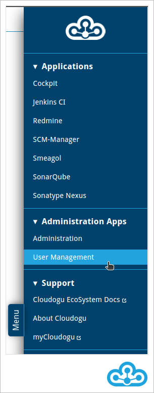
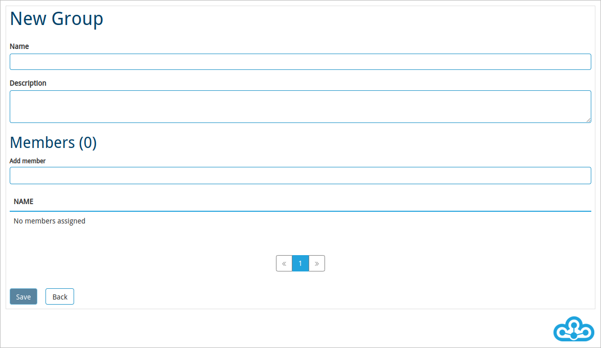
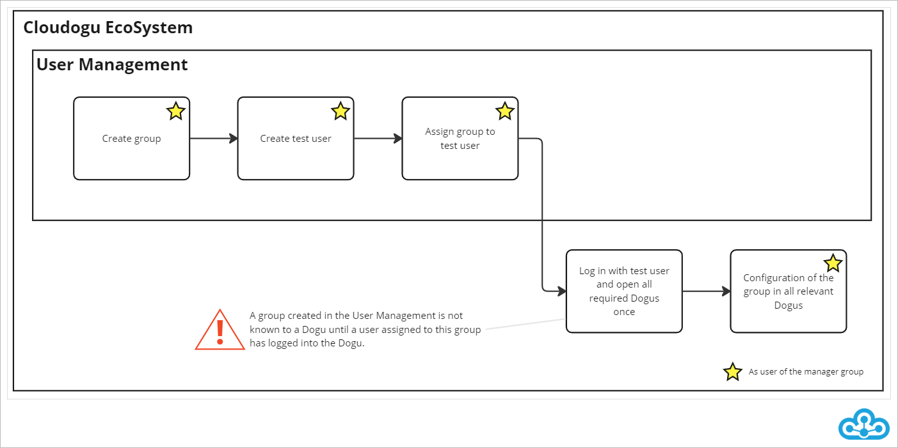
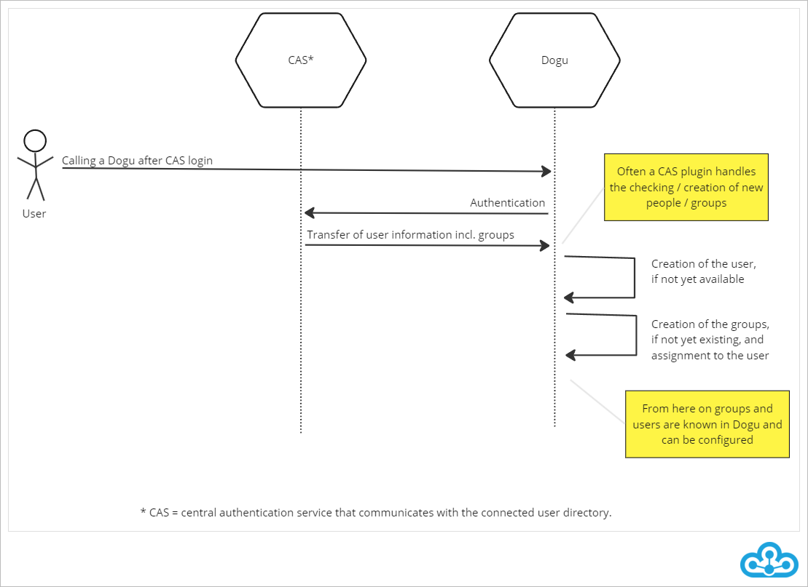

# User Management

The **User Management** is a Dogu for **managing the users and groups of the Cloudogu EcoSystem**. In addition to your own personal data, you can create, edit and delete users and groups, depending on the rights you have.

The **User Management** can be accessed via the Warp Menu in the "Administration" area.



## Personal data

As a user of the Cloudogu EcoSystem you can change **your personal data** in the account area.


The personal account area is displayed directly when you open the **User Management**. Via the 
form you can adjust your personal data like your e-mail address or your password. The adjustments you make will only be **updated** by clicking on the save button. The username cannot be changed.

In the lower part of the account area you can see your assigned groups.


## Administration of accounts

As an administrator you have the possibility to create, delete and edit users in the **User Management**.

### Search for accounts

If you manage a large number of users, the **search function** will help you find the account you need.

1. Select the "users" tab.


2. In the filter section, enter the username, display name or e-mail address of the account you want to find and press *Enter*. The table will show you the accounts matching your search criterion.


To remove the filter again, click on the "X" symbol inside the search field.

### Changing account data

To change the data of an account, first click on the pencil icon in the row of the account you want to change.


Afterwards, you can make changes and save them by clicking the "Save" button. 
Besides the account information like email address or display name, you can also change the password. In addition to that, the **User Management** offers the possibility to force the user to change the password at the next login.

Note that you **cannot** change the username.

### Deleting accounts

To delete an account, go to the "Users" page and click on the trash can icon in the row of the account you want to delete. A confirmation prompt follows, which you must confirm before the account is finally deleted.

Note that accounts deleted in **User Management** are not automatically deleted in the Dogus as well.


### Creating new accounts

To create a new account for the Cloudogu EcoSystem, first call up the "Users" tab and click on the "Create user" button.


A form will open where you can enter the following attributes of the new account:

* Username* (for logging into the Cloudogu EcoSystem).
* First name
* Last name
* Display name (displayed name of the user in the individual Dogus)
* Email* (user will be notified via this email)
* Password (for logging into the Cloudogu EcoSystem)
* "User must change password at next login" (If this option is enabled, the user must change the password at the next login).

\* A user's email address and username are **unique properties** and may therefore only be used for one account. When creating an account, the system validates whether email address and username are unique. If this is not the case, you will receive a meaningful error message and you will be able to edit the account details.

> Note that the username is **unchangeable** after the account has been created.


You create the account by clicking on the "Save" button.


After you have saved, the newly created account will be displayed on the "Users" page. 
If you want to make further changes, click on the pencil icon in the last column.

### Password policies

In the Cloudogu EcoSystem configuration, **password policies** can be configured to be validated when passwords are entered. 
By creating reasonable password policies, the security of passwords can be controlled globally.

When you create a password, you will always see the password policies that are not satisfied. Once a password policy is satisfied, it will disappear.


You can't save the password until all password policies are satisfied.

If all password policies are fulfilled, the input field will be marked green and the new password can be saved.


## Administration of groups

As an administrator, the **User Management** gives you the ability to **create, edit, or delete groups, as well as manage the members of groups**.

Groups can be used to manage different permission configurations for different permission configuration. More information about this can be found in the section [Permission concept in the Cloudogu EcoSystem](#permission-concept-in-the-cloudogu-ecosystem).

### System groups

In the **User Management** you will find two predefined groups. Members of these groups have special permissions in the Cloudogu EcoSystem Dogus.

**Manager Group**

Members of the **Manager Group** have **full access to the User Management** of the Cloudogu EcoSystem.
This gives users the authorization to create and manage additional users and groups.
Beyond that, no other permissions are associated with the *Manager Group**.

You can change the *Manager group* to be used by changing the entry `/config/_global/manager_group` in the configuration of the Cloudogu EcoSystem to the desired group:

```shell
etcdctl set /config/_global/manager_group newManagerGroup
```

The **User Management** Dogu needs to be restarted to take the change into account.

**Admin Group**

Members of this group have administrative rights in **all** Dogus of the Cloudogu EcoSystem. 
These users can use the administrative functions in the individual Dogus and thus, for example, install plug-ins or make application settings.

The usage of the **Backup & Restore** Dogu is restricted to the administrators.
Consequently, only users who are members of the **Admin group** have access to the **Backup & Restore** Dogu.

You can change the **Admin group** to be used by changing the entry
`/config/_global/admin_group` in the configuration of the Cloudogu EcoSystem to the desired group:

```shell
etcdctl set /config/_global/admin_group newAdminGroup
```

All Dogus needs to be restarted for the change to take effect.

### Creating a new group

To avoid assigning individual permissions for all accounts in the Dogus, you can create groups as described below:

Select the "Groups" tab in **User Management**.


Click on the "Create group" button.



Then define the properties of the new group:
  * Name*
  * Description

  \* The name of a group is a **unique property** and therefore may only be used for one group. When creating a group, the system checks if the name is unique. If it is not, you will get a meaningful error message and you will be able to change the name of the group.

> Note that the group name is unchangeable after the group has been created. 

Create the group by clicking on the "Save" button.

### Group assignment

There are two ways to assign an account to a group:
* Via editing the account
* Via editing the group

**Group assignment via editing an account:**.

1. In the "Users" tab, select the pencil icon for the corresponding account.
2. Then enter the group name in the "Groups" area under *Add group*. A list of suggestions will automatically appear according to the input you have made.
3. Click on the desired group to assign the account to the group.


4. Click on the "Save" button to save the changes.

**Group assignment via editing a group:**.

1. In the "Groups" tab, select the pencil icon for the corresponding group.
2. In the "Members" area, you can add the user name of the desired member. A list of suggestions will appear automatically according to the input made. 
3. Click on the desired user name in the list of suggestions to add the account to the group. 


4. Click on the "Save" button to save the assignment.

### Deleting a group

To delete a group, click on the trash can icon of the respective group in the "Groups" area and confirm the security prompt.

System groups **cannot** be deleted.

Note that groups deleted in the **User Management** are not automatically deleted in the Dogus. However, the assignment of accounts to groups is synchronized.

## Permission concept in the Cloudogu EcoSystem

The permission concept of the Cloudogu EcoSystem is based on a **central user management** and a **decentralized permission configuration**: Accounts and groups can be stored in the **User Management**. These are propagated to the other Dogus of the Cloudogu EcoSystem, allowing you to assign permissions for groups or individual users decentralized in each Dogu.

### User Management

The **User Management** is used to manage accounts and groups. In doing so, the **User Management** uses an internal *LDAP* as directory service.

In addition to using the **User Management** provided by us, you have the option of using an **external directory service** for the Cloudogu EcoSystem. In this case, user management would **not** be done via the Dogu **User Management** presented here, but via the external directory service you have connected.

### Permission concepts of the Dogus

You can create the accounts for users of the Cloudogu EcoSystem centrally in the **User Management**. To simplify the permission configuration, you can create groups for different user purposes. A user can belong to more than one group. A group can have more than one member.

Accounts and groups are **synchronized** with the Dogus, meaning in each Dogu you will find the accounts and groups created in the **User Management**. 

Since Dogus may be applications developed outside of the Cloudogu EcoSystem, the **permission concept in the Dogus may differ** - as you can see in the following diagram exemplary.


For more information about the permission concept of individual Dogus, please refer to the documentation of the respective Dogu.

You can also create accounts and groups directly in the Dogus. Please note that these are then not known to other Dogus and cannot be managed in the **User Management**. Creating accounts or groups outside of the **User Management** is therefore **not** recommended.

### Synchronization of accounts and groups

User accounts and groups are forwarded to a Dogu **as soon as the the respective account logs into the Dogu**. For this purpose, the user's group assignments are queried every time the user logs on to a Dogu via the CAS (Central Authentication Service) - the central *single sign-on* authentication service of the Cloudogu EcoSystem.

As can be seen in the following diagram, the CAS passes the required user information to the Dogu after successful authentication. The Dogu then validates whether the user's account and groups already exist. If this is not the case, the account and groups are created and assigned if the Dogu supports this procedure.

In Dogus that do not manage groups or accounts, no groups or accounts will be created. For other Dogus, the creation of accounts and groups is often done by a CAS plugin that has been designed for this purpose.

 

 If a user's account has already been created internally in a Dogu, the internal account will be linked to the external CAS account if the internal user name matches the external user name. This *usually* overwrites the internal data in the Dogu with the data from the **User Management** and the account is marked as an external account in the Dogu, if possible.

When creating accounts and groups in the **User Management**, please note that modified or newly created accounts, groups and group assignments are **not directly** known in other dogus, but **will be made known the next time the user logs in to the respective Dogu**.

### Possible procedure for permission configuration

If you as administrator want to create a new group and configure it directly in different Dogus, the procedure shown in the following diagram can be recommended.

 

With the help of a test account you can log into the Dogus where you want to configure the newly created group. After you have configured the group with your account in the Dogu, you can additionally use the test account to test the configuration.