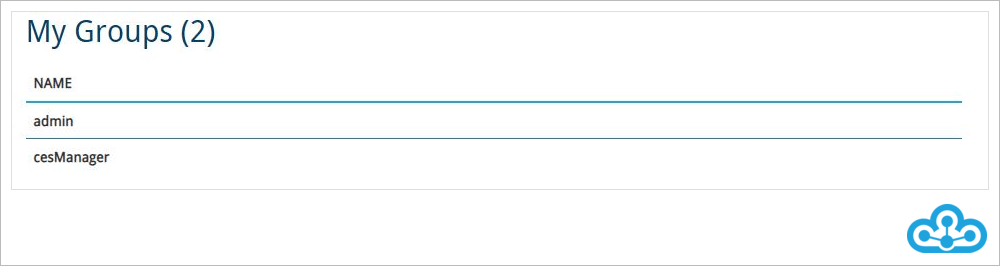
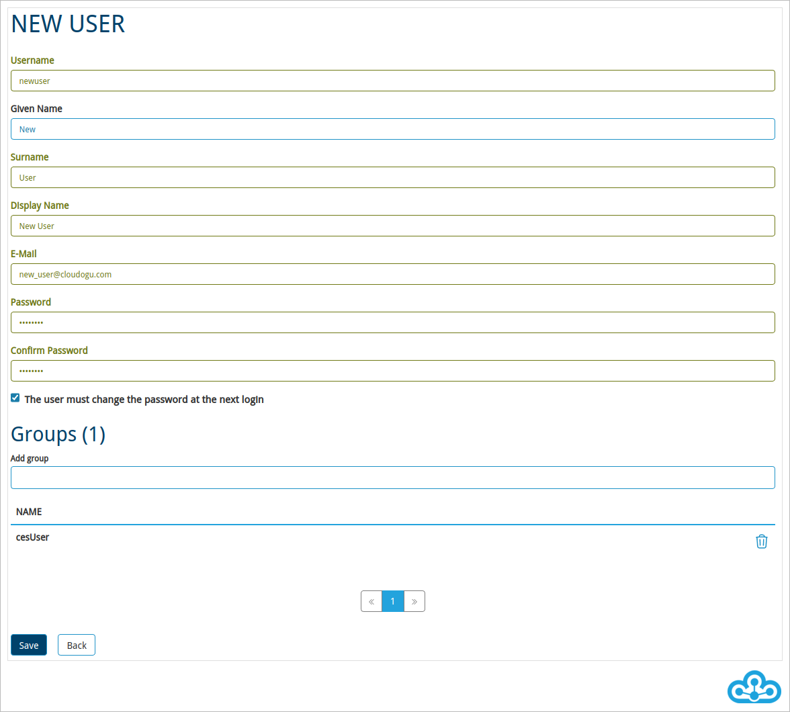
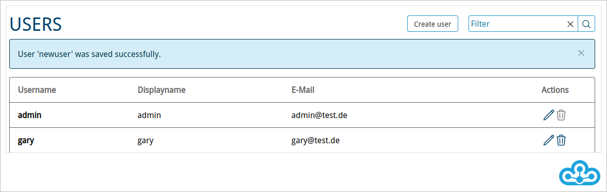
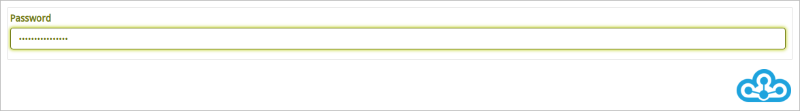
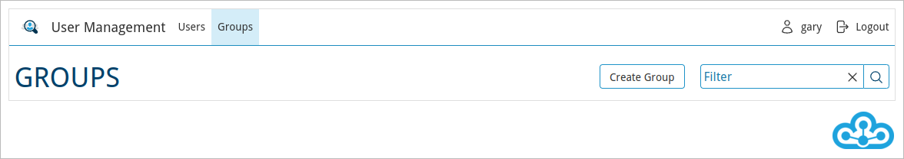

# User Management

If no external directory service is configured for the Cloudogu EcoSystem, the Dogu “User Management” can be used
to create users and administer groups.

If an external directory service (such as LDAP or AD) is connected, user management is performed via the connected service.

The “User Management” can be accessed via the Warp Menu in the “Administration Apps” area.


## Personal data

As a user of the Cloudogu EcoSystem you can change your personal data in the account area.


After you have called the “User Management”, your account area will be displayed automatically. Via the displayed
form you can change your personal data and confirm your entries by clicking on the save button.

In the lower part of the account area you can see your group memberships.



Administrators have further options in the User Management to create users, to manage their group memberships and to set passwords for example.


## Access as administrator

As an administrator you also have the ability to manage users and groups.

### Search for users

If you need to administer a large number of users, the search function will help you.

1. Select the “Users” tab.


2. There, in the “Filter” section, enter the “username” or the “display name” of the user you want to search for and press Enter.
   To reset the filter, click on the “X” symbol inside the search field.


### Editing user data

To change the settings of a user, first click on the pencil icon in the last column on the “Users” tab.


After that you can make changes and save them by clicking the “Save” button.

### Creating new users

To create a new user for the Cloudogu EcoSystem, first call up the “Users” tab.


2. Now click on the button “Create user”.



3. Make the entries and save by clicking on the “Save” button. 

Configurable properties are:
* User name (used for login, unique attribute).
* Given Name
* Surname
* Display Name (will be displayed in the individual dogus for the user)
* E-Mail (used for notification functions, unique attribute)
* Password (used for login to Cloudogu EcoSystem)
* “User must change password at next login” Flag: If this option is enabled, the user must change his password after the next login.



After you have saved, the newly created user will be displayed on the “Users” page.
If you want to make further changes, click on the pencil icon in the last column.

> Keep in mind that the username is immutable after the user is created.

#### Unique attributes

The e-mail address and the username of a user may only appear once.

If an attempt is made to create a user with a username that already exists, the following error message is displayed:


If you try to create a user with an email address that already exists the following error message will be displayed:


### Password policies

In the Cloudogu EcoSystem configuration, password policies can be configured to be validated as passwords are entered.
By creating meaningful password policies, the security of passwords can be controlled globally.

##### Workflow

1. All password policies that are not fulfilled are displayed in red.


2. As soon as a password policy is satisfied, it is no longer shown as unfulfilled.


3. If all password policies are fulfilled, the field is marked green and the new password can be saved.



### Delete user

To do this, click on the trash can icon on the “Users” page, which is shown in the last column and in the row of the user to be deleted. Then confirm the security prompt.

### Create new group

To avoid having to assign permissions to each user individually, groups can be created.

1. Select the “Groups” tab in User Management.
2. Click on the “Create group” button.



3. Fill the fields and submit the formular by clicking the “Save” button


Configurable properties are:
* Name (unique attribute)
* Description

> Keep in mind that the group name is immutable after the group is created.

### Group assignment
There are two ways to make the assignment:

1. Via changing the data of a user:

* In the “Users” tab, select the pencil icon in the last column for the corresponding user.
* Then enter the group name in the “Groups” section. A list of suggestions will automatically appear
  suggestions according to the input made. With a click on one of the listed entries the selected group will be assigned.


* Click on the “Save” button to save the assignment.

2. Via the group properties:

* In the “Groups” tab, select the pencil icon in the last column for the corresponding group.
* Then enter the username in the “Members” section. A list with suggestions will appear automatically
  suggestions according to the input made. By clicking on a user in the suggestion list, the user will be
  assignment.


* Click on the “Save” button to save the assignment.

### Delete groups

To do this, click on the trash can icon of the respective group in the “Groups” area in the last column and confirm the security prompt.

The two system groups (admin/manager - see below) cannot be deleted.

### Group permissions

In User Management, you will find predefined groups under “Groups”. These groups have special permissions in the Cloudogu EcoSystem dogus.

**Manager group**

Members of this group have full access to the “User Management” of the Cloudogu EcoSystem.
This gives users the authorization to create and manage additional users on the one hand and groups on the other.
Beyond that, no further authorizations are associated with the “Manager” group.

You can change the “Manager” group to be used by editing the configuration of the Cloudogu EcoSystem in the entry
`/config/_global/manager_group` to set the desired group.

```shell
etcdctl set /config/_global/manager_group newManagerGroup
```

The “User Management” dogu must then be restarted for the change to take effect.

**Admin group**

Members of this group have administrative privileges in **all** dogus of the Cloudogu EcoSystem, e.g. Jenkins, Redmine or SCM-Manager. 
permissions. This means that users can use the administrative functions in the individual dogus 
and thus, for example, install plug-ins or make application settings.

The  “Backup & Restore” dogu contains only administrative functions and does not use a separate role concept.
Thus, only users who are members of the “Admin” group have access to the “Backup & Restore” dogu.

You can change the “Admin” group to be used by editing the configuration of the Cloudogu EcoSystem in the entry
`/config/_global/admin_group` to set the desired group.

```shell
etcdctl set /config/_global/admin_group newAdminGroup
```

All Dogus must then be restarted for the change to take effect.

### CAS transfer of rights

The group assignments of the users are queried each time they log on to a dogu via the CAS (Central Authentication Service).
every time a user logs on to a Dogu. The CAS forms the central single sign-on authentication system in the Cloudogu EcoSystem. Changed
in the user management or an external directory service are thus applied the next time a user logs on to the system.
user logs into the respective dogus.

Translated with www.DeepL.com/Translator (free version)