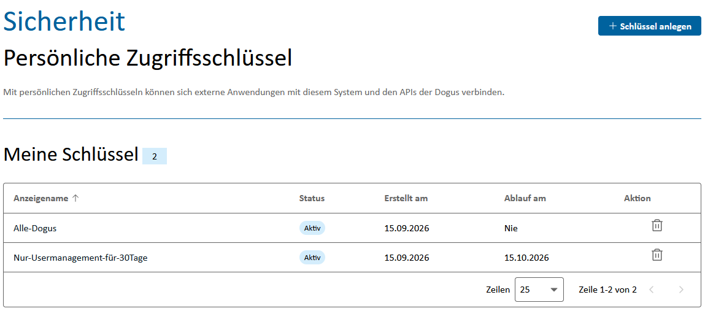
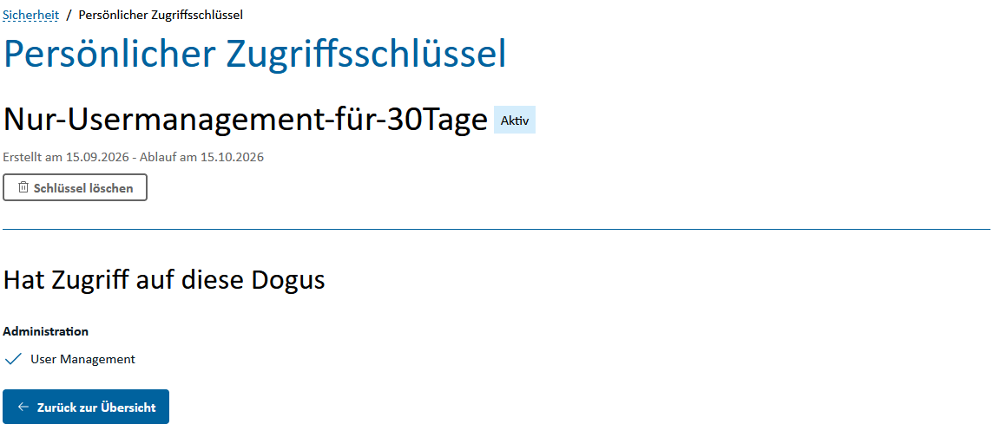
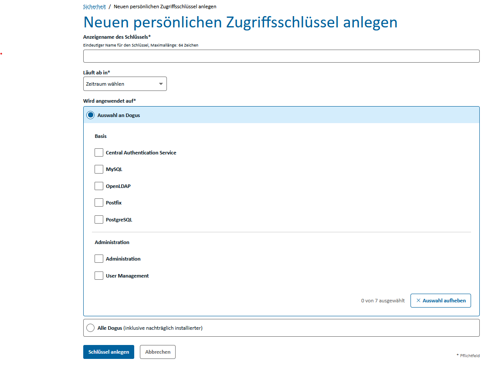
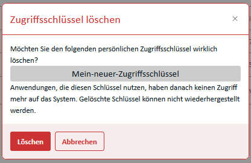

# Persönliche Zugriffsschlüssel (PATs)

Persönliche Zugriffsschlüssel (Personal Access Tokens, kurz **PATs**) ermöglichen externen Anwendungen und Skripten den Zugriff auf die APIs des Cloudogu EcoSystems. Ein PAT wird einem Benutzerkonto zugeordnet und kann auf ausgewählte Dogus beschränkt werden.

> Ein PAT ist ein Zugangsdaten-Geheimnis und muss wie ein Passwort behandelt werden. Speichern Sie den Schlüssel sicher und geben Sie ihn nicht an andere Personen weiter.

## Voraussetzungen

Für die Verwaltung von PATs müssen Sie am Cloudogu EcoSystem angemeldet sein. Sie können ausschließlich Ihre eigenen Zugriffsschlüssel anzeigen, erstellen und löschen.

## PATs anzeigen und verwalten

1. Öffnen Sie das **User Management** über das Warp-Menü.
2. Wechseln Sie zum Bereich **Sicherheit**.
3. Unter **Meine Schlüssel** werden Ihre vorhandenen PATs angezeigt.

Die Übersicht enthält den Anzeigenamen, Status, Erstellungszeitpunkt und Ablaufzeitpunkt eines Schlüssels. Aktive und abgelaufene Schlüssel sind entsprechend gekennzeichnet. Über die Spaltenüberschriften können Sie die Liste sortieren.



Klicken Sie auf den Anzeigenamen eines Schlüssels, um dessen Details und die freigegebenen Dogus anzuzeigen. Der eigentliche Schlüsselwert kann nach der Erstellung nicht erneut angezeigt werden.



## PAT erstellen

1. Öffnen Sie im Bereich **Sicherheit** die PAT-Übersicht.
2. Klicken Sie auf **Schlüssel anlegen**.
3. Tragen Sie einen eindeutigen **Anzeigenamen des Schlüssels** ein. Der Name darf höchstens 64 Zeichen lang sein und keine Leerzeichen oder unsichtbaren Sonderzeichen enthalten.
4. Wählen Sie unter **Läuft ab in** eine Gültigkeitsdauer aus. Verfügbar sind 7, 30, 60 oder 90 Tage sowie **Nie**.
5. Legen Sie unter **Wird angewendet auf** den Geltungsbereich fest:
   - Mit **Auswahl an Dogus** gilt der PAT nur für die ausgewählten Dogus.
   - Mit **Alle Dogus** gilt er auch für Dogus, die später installiert werden.
6. Klicken Sie auf **Schlüssel anlegen**.

Wählen Sie aus Sicherheitsgründen nur die Dogus aus, die die Anwendung tatsächlich benötigt, und bevorzugen Sie eine begrenzte Gültigkeitsdauer.



Nach der Erstellung erscheint ein Dialog mit dem neuen Zugriffsschlüssel. Kopieren Sie den vollständigen Schlüssel und speichern Sie ihn an einem sicheren Ort, beispielsweise in einem Secret Store oder Passwortmanager.

> **Wichtig:** Der Schlüssel wird nur einmal angezeigt. Wenn er verloren geht, muss der PAT gelöscht und neu erstellt werden.


## PAT verwenden

Ein PAT wird für API-Aufrufe über HTTP Basic Authentication verwendet:

- **Benutzername:** Ihr Benutzername im Cloudogu EcoSystem
- **Passwort:** der bei der Erstellung angezeigte PAT

Das folgende Beispiel ruft die Account-API des User Managements auf:

```bash
curl --user '<benutzername>:<pat>' \
  'https://<ces-host>/usermgt/api/account'
```

Vermeiden Sie es, den PAT direkt in Skripten oder im Klartext in Konfigurationsdateien zu hinterlegen. Verwenden Sie stattdessen Umgebungsvariablen oder die Secret-Verwaltung Ihrer Anwendung. Bei `curl` kann der PAT beispielsweise interaktiv abgefragt werden:

```bash
curl --user '<benutzername>' \
  'https://<ces-host>/usermgt/api/account'
```

Der Zugriff funktioniert nur für Dogus, die beim Erstellen des PATs freigegeben wurden. Ein PAT übernimmt die Berechtigungen des zugehörigen Benutzerkontos; er erteilt keine zusätzlichen Rechte.

## PAT löschen

Löschen Sie einen PAT, wenn er nicht mehr benötigt wird, abgelaufen ist oder möglicherweise offengelegt wurde.

Sie können einen PAT auf zwei Wegen löschen:

- Klicken Sie in der PAT-Übersicht auf das Papierkorb-Symbol in der entsprechenden Zeile.
- Öffnen Sie die Detailansicht und klicken Sie auf **Schlüssel löschen**.

Bestätigen Sie anschließend den Löschdialog.



Nach dem Löschen wird der PAT sofort ungültig. Anwendungen, die diesen Schlüssel verwenden, können damit nicht mehr auf das System zugreifen. Ein gelöschter PAT kann nicht wiederhergestellt werden.

## Sicherheitsempfehlungen

- Verwenden Sie für jede Anwendung einen eigenen PAT mit einem aussagekräftigen Anzeigenamen.
- Beschränken Sie den PAT auf die tatsächlich benötigten Dogus.
- Wählen Sie nach Möglichkeit ein Ablaufdatum.
- Übertragen Sie PATs ausschließlich über verschlüsselte HTTPS-Verbindungen.
- Speichern Sie PATs nicht in Quellcode, Tickets, Chat-Nachrichten oder Protokollen.
- Löschen und ersetzen Sie einen PAT sofort, wenn er offengelegt worden sein könnte.
- Entfernen Sie PATs, die nicht mehr verwendet werden.

## Fehlerbehebung

| Problem | Mögliche Ursache und Lösung |
| --- | --- |
| Die API antwortet mit `401 Unauthorized`. | Prüfen Sie Benutzername und PAT. Der PAT könnte abgelaufen oder gelöscht worden sein. |
| Die API antwortet mit `403 Forbidden`. | Das Benutzerkonto besitzt nicht die erforderliche Berechtigung oder der PAT gilt nicht für das aufgerufene Dogu. |
| Ein Dogu ist nicht auswählbar. | Prüfen Sie, ob das Dogu installiert und verfügbar ist. |
| Der Schlüsselwert ist nicht mehr sichtbar. | PATs werden nur einmal vollständig angezeigt. Löschen Sie den PAT und erstellen Sie einen neuen. |
| Eine Anwendung verliert nach dem Löschen den Zugriff. | Das ist das erwartete Verhalten. Hinterlegen Sie bei Bedarf einen neu erstellten PAT in der Anwendung. |

