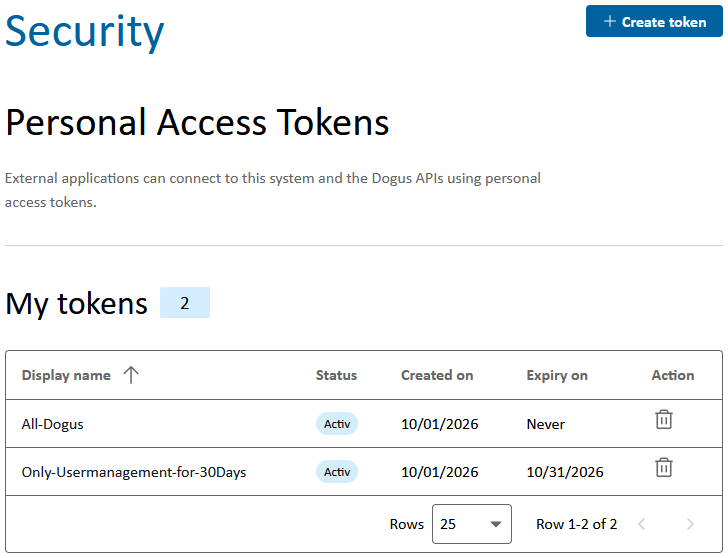
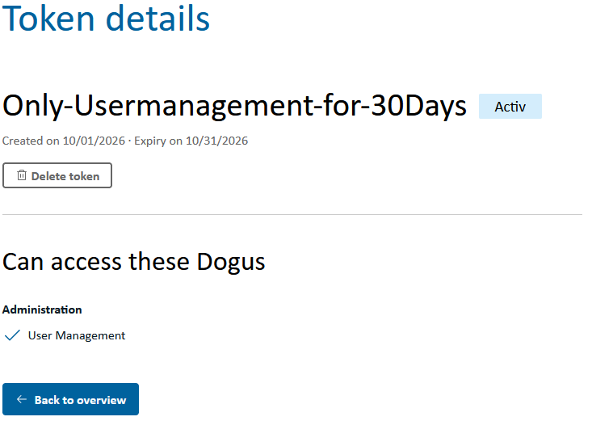
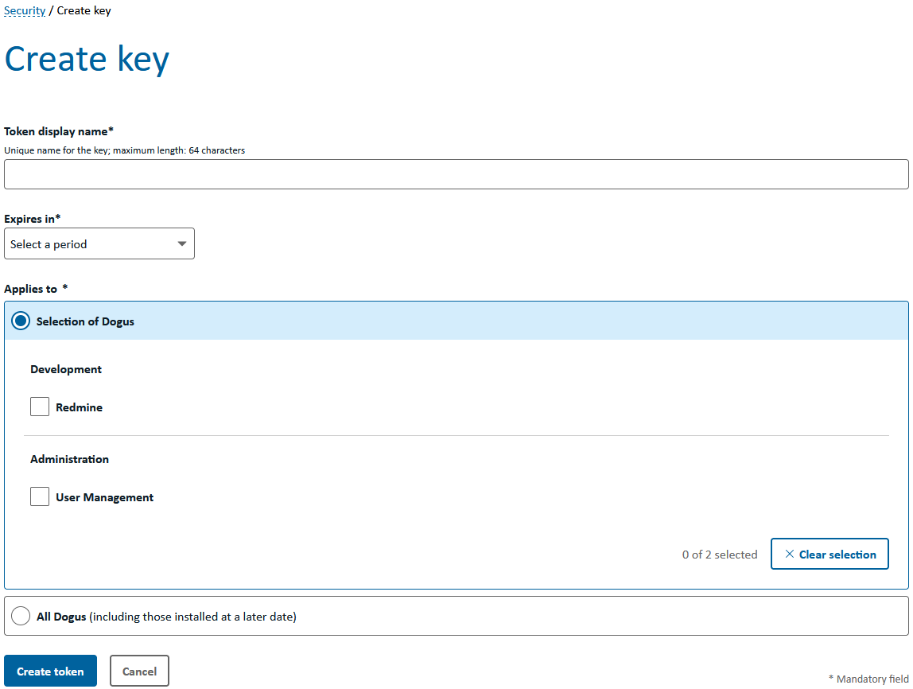
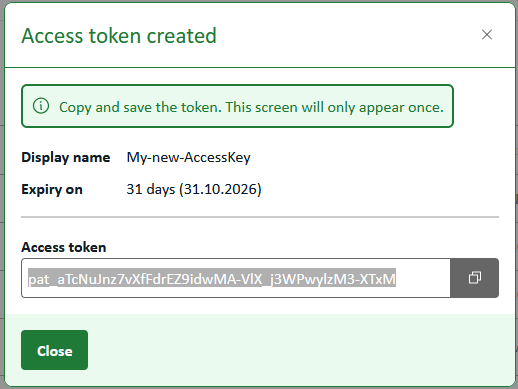
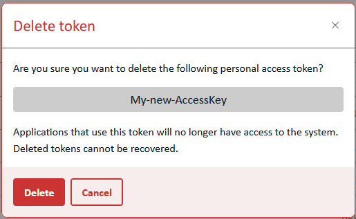

# Personal Access Tokens (PATs)

Personal Access Tokens (**PATs**) allow external applications and scripts to access the APIs of the Cloudogu EcoSystem. A PAT is associated with a user account and can be restricted to selected Dogus.

> A PAT is a secret credential and must be treated like a password. Store the token securely and do not share it with other people.

## Prerequisites

You must be logged in to the Cloudogu EcoSystem to manage PATs. You can only view, create, and delete your own access tokens.

## Viewing and managing PATs

1. Open **User Management** from the Warp menu.
2. Go to the **Security** section.
3. Your existing PATs are listed under **My tokens**.

The overview shows each token's display name, status, creation date, and expiry date. Active and expired tokens are marked accordingly. You can sort the list using the column headings.



Click a token's display name to view its details and the Dogus it can access. The actual token value cannot be displayed again after creation.



## Creating a PAT

1. Open the PAT overview in the **Security** section.
2. Click **Create token**.
3. Enter a unique **Token display name**. The name must not exceed 64 characters and must not contain whitespace or invisible special characters.
4. Select a validity period under **Expires in**. The available options are 7, 30, 60, or 90 days, and **Never**.
5. Define the scope under **Applies to**:
   - With **Selection of Dogus**, the PAT is valid only for the selected Dogus.
   - With **All Dogus**, it is also valid for Dogus installed at a later date.
6. Click **Create token**.

For security reasons, select only the Dogus the application actually needs and prefer a limited validity period.



After creation, a dialog displays the new access token. Copy the complete token and store it in a secure location, such as a secret store or password manager.

> **Important:** The token is displayed only once. If it is lost, the PAT must be deleted and a new one created.



## Using a PAT

A PAT is used for API requests via HTTP Basic Authentication:

- **Username:** Your username in the Cloudogu EcoSystem
- **Password:** The PAT displayed during creation

The following example calls the User Management account API:

```bash
curl --user '<username>:<pat>' \
  'https://<ces-host>/usermgt/api/account'
```

Avoid embedding the PAT directly in scripts or storing it in plain text in configuration files. Use environment variables or your application's secret management instead. With `curl`, for example, you can enter the PAT interactively:

```bash
curl --user '<username>' \
  'https://<ces-host>/usermgt/api/account'
```

Access works only for Dogus included in the PAT's scope during creation. A PAT inherits the permissions of its associated user account; it does not grant additional permissions.

## Deleting a PAT

Delete a PAT when it is no longer needed, has expired, or may have been exposed.

You can delete a PAT in two ways:

- Click the trash icon in the corresponding row of the PAT overview.
- Open the detail view and click **Delete token**.

Then confirm the deletion in the dialog.



Once deleted, the PAT becomes invalid immediately. Applications using this token can no longer use it to access the system. A deleted PAT cannot be recovered.

## Security recommendations

- Use a separate PAT with a descriptive display name for each application.
- Restrict the PAT to the Dogus that are actually needed.
- Choose an expiry date whenever possible.
- Transmit PATs only over encrypted HTTPS connections.
- Do not store PATs in source code, tickets, chat messages, or logs.
- Delete and replace a PAT immediately if it may have been exposed.
- Remove PATs that are no longer in use.

## Troubleshooting

| Problem | Possible cause and solution |
| --- | --- |
| The API responds with `401 Unauthorized`. | Check the username and PAT. The PAT may have expired or been deleted. |
| The API responds with `403 Forbidden`. | The user account does not have the required permission, or the PAT's scope does not include the requested Dogu. |
| A Dogu cannot be selected. | Check whether the Dogu is installed and available. |
| The token value is no longer visible. | PATs are displayed in full only once. Delete the PAT and create a new one. |
| An application loses access after deletion. | This is the expected behavior. If needed, configure the application with a newly created PAT. |
