Translated with www.DeepL.com/Translator

# User Management
If no external directory service is configured for the Cloudogu EcoSystem, the Dogu "User Management" can be used to create users, manage rights and administer groups. If an external directory service is connected, the management of master data will be done through it.
\newline

User Management can be accessed via the Warp Menu in the Administration section.

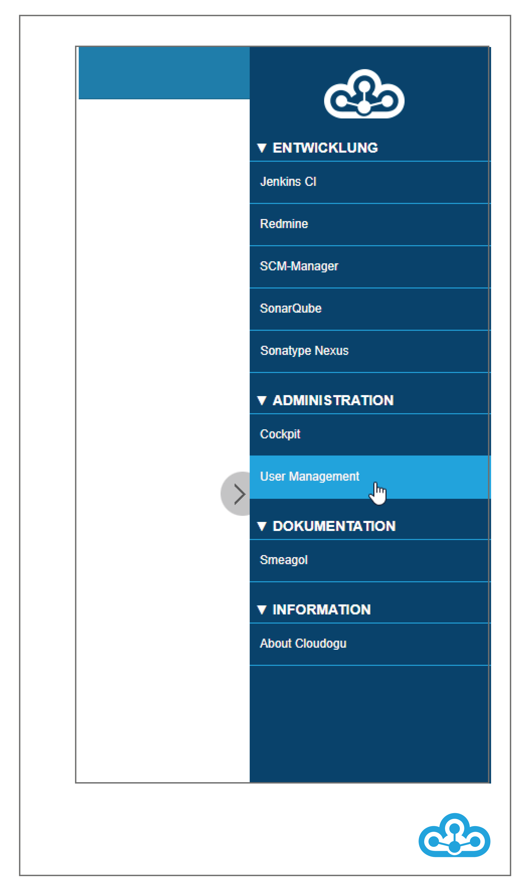

## Personal data
As a user of Cloudogu EcoSystem, you can change your personal data and permissions in the "Account" area.

1. After you have called up the User Management, the "Account" area is automatically displayed.
   Under "Options" you can change your personal data. 3.
3. click on "Save" to save the changes.

Administrators have further options in User Management to create users, manage their group memberships and to set passwords, for example.

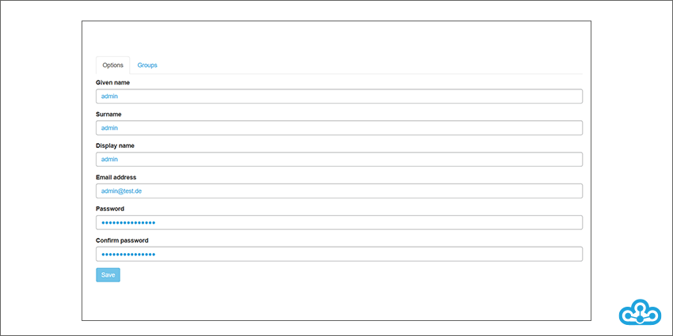

## Access as administrator
As an administrator you also have the ability to manage users and groups.

### Search for users
If you have to administer a large number of users, the search function will help you.

1. select the "Users" tab.

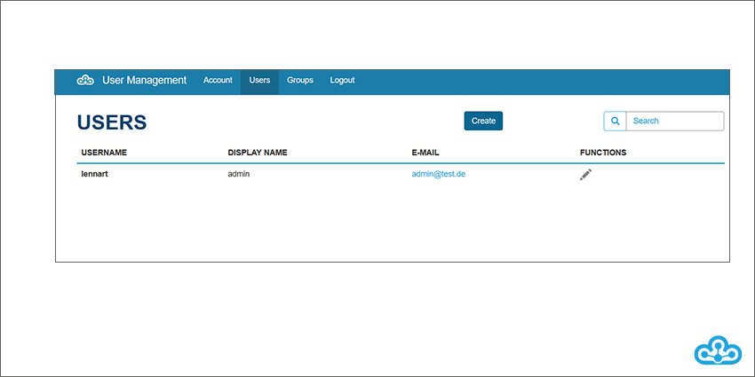

2. in the "Search" section, enter the "Username" or "Display Name" of the user you want to search for and press Enter.

### Editing user data
To change the settings of a user, first click on the pencil in the "Functions" column on the "Users" tab.

Anschlie\ss end you can make changes and save them by clicking on "Save".

### Creating new users
To create a new user for the Cloudogu EcoSystem, first call up the "Users" tab.

2. click on the button "Create" at the end.

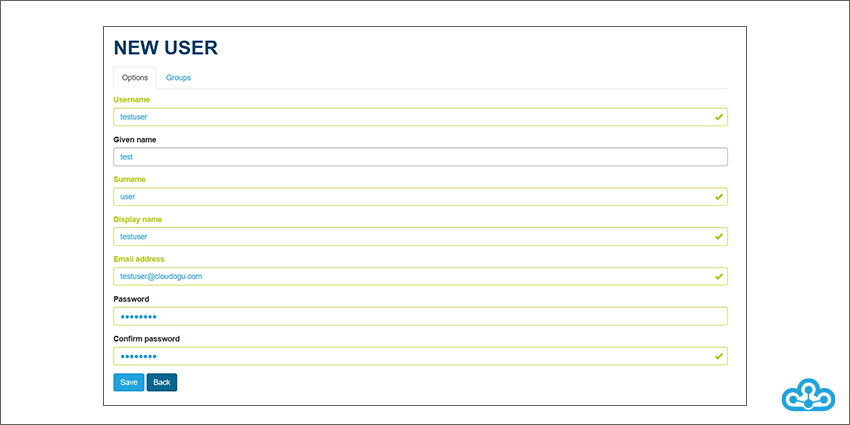

3. make the entries and save with "Save". Configurable properties are:
* Username
* Given Name
* Surname
* Display name
* Email address
* Password

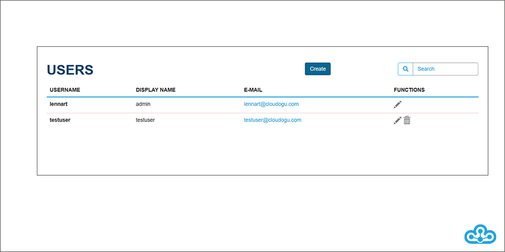

After you have saved, the newly created user will be displayed on the "Users" page. If you want to make any further changes, click on the "Pencil" icon in the "Functions" column.

#### Unique attributes

A user's email address and username may only occur once.

If an attempt is made to create a user with a user name that already exists, the following error message is displayed:

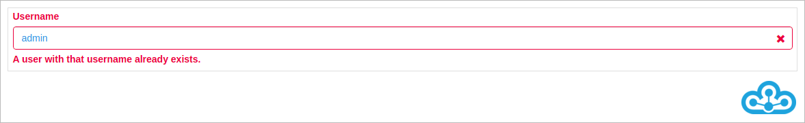

If you try to create a user with an email address that already exists the following error message will be displayed:

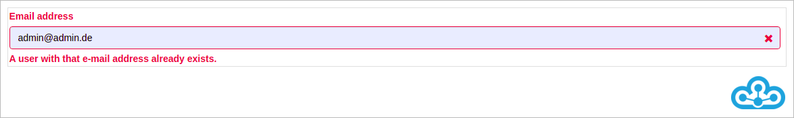

### Password policies
In User Management, password policies can be configured to be validated as passwords are entered. By creating meaningful password policies, the security of passwords can be controlled globally.

##### Procedure
1. all password policies that are not fulfilled are displayed.

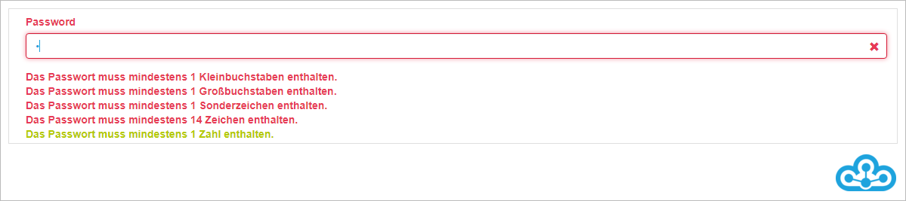

2. as soon as a password policy is satisfied, it is highlighted in green.

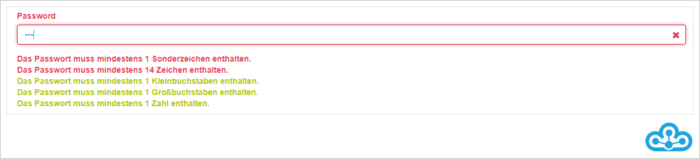

3. once all password policies are satisfied, the new password can be saved.

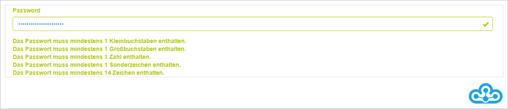

##### Exceptions
If password policies have been configured incorrectly, they will be displayed. It is then not possible to enter passwords in the system. In this case, the administrator must correct the settings.

If an invalid regex has been used for configuration, an error message will be displayed according to the following pattern:

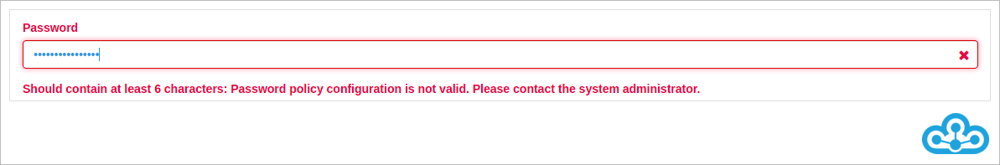

### Delete user
To do this, click on the "Trash can" icon on the "Users" page, which is shown in the "Functions" column and in the row of the user you want to delete. Confirm the security prompt at the end.

### Create new group
To avoid having to assign permissions to each user individually, groups can be created.

Select the "Groups" tab in User Management. 2.
2. click on the "Create" button.

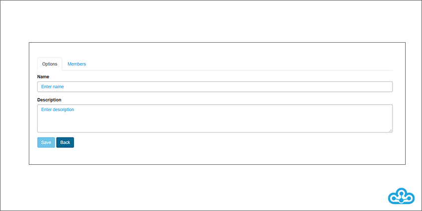

3. make your entries in the "Name" and "Description" sections.

### Group assignment
There are two ways to make the assignment:

1. by changing the data of a user:
* In the "Users" tab, select the "Pen" icon in the "Functions" column for the corresponding user.
* Anschlie\ss end select the "Groups" tab and enter the corresponding group name.
* Then click on the "Options" tab and there on "Save" to save your assignment.

2. via the group properties:
* In the "Groups" tab, select the "Pen" icon in the "Functions" column for the appropriate group.
* Click on the "Members" tab.
* Enter the appropriate username under "Add member".
* Click on the "Options" tab and then on "Save" to complete your assignment.

### Delete groups
To do this, click on the "Trash can" icon for the relevant group in the "Groups" area under "Functions" and confirm the security prompt.

### Group permissions
In User Management, you will find predefined groups under "Groups". These groups have certain permissions in the Cloudogu EcoSystem dogus. \newline

**cesManager Group**
Members of this group have full access to the User Management of the Cloudogu EcoSystem and can thus also create and manage users. \newline

**admin group
Members of this group have administrative rights in all dogus of the Cloudogu EcoSystem. This means that members can administer the individual tools and, for example, install plugins or create user roles.

### CAS Transfer of rights
The rights of users and group authorizations are queried anew each time they log on to a Dogu via the CAS (Central Authentication Service). The CAS forms the central single sign-on authentication system in the Cloudogu EcoSystem. Changed rights in user management or an external directory service are thus transferred to the respective dogus the next time a user logs on.
